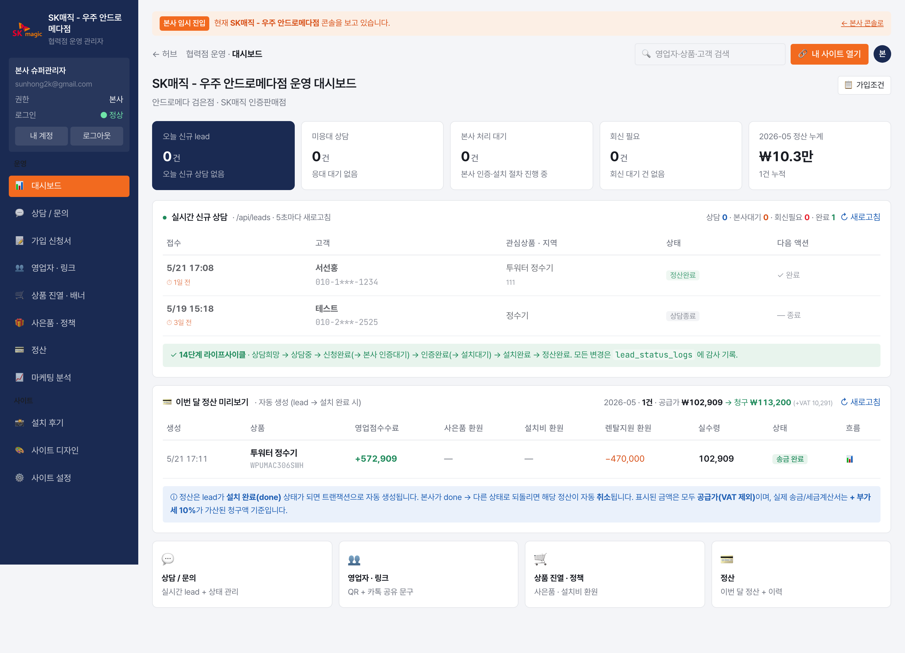
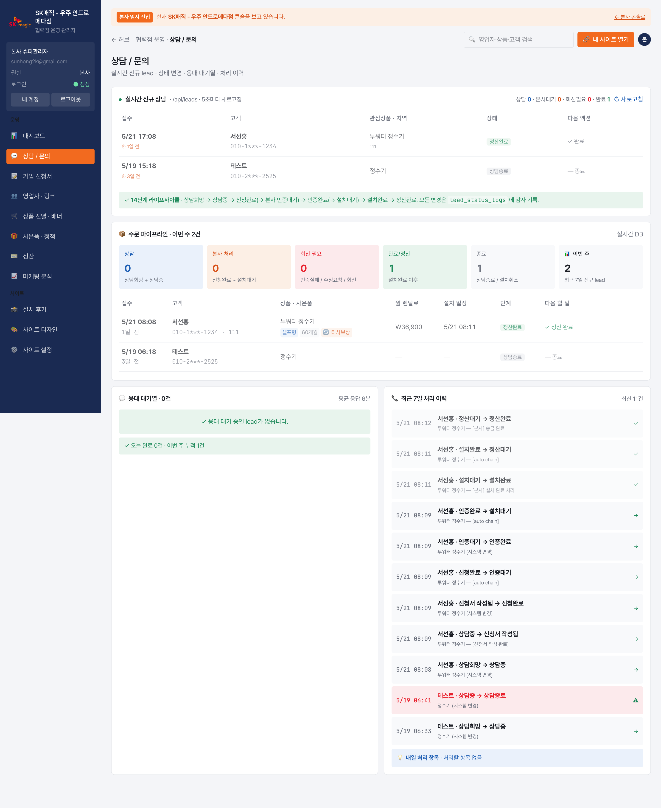
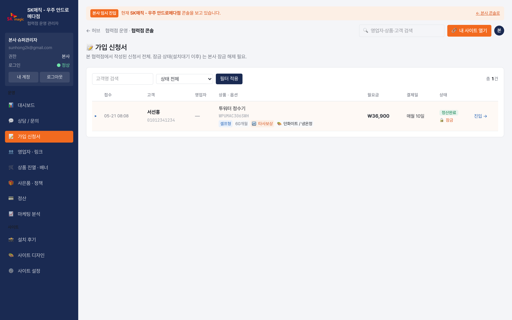
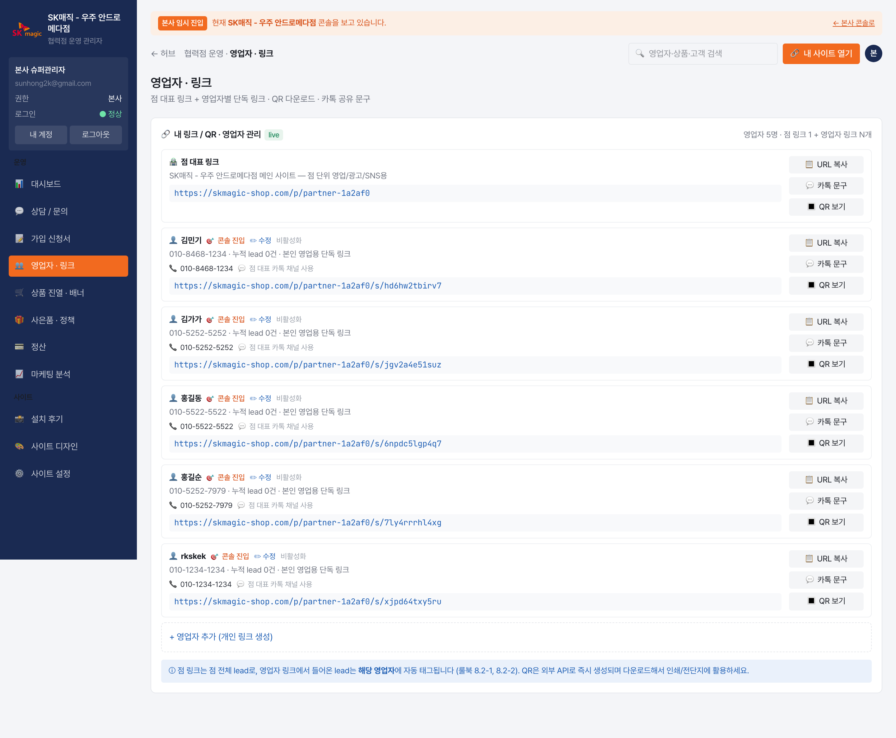
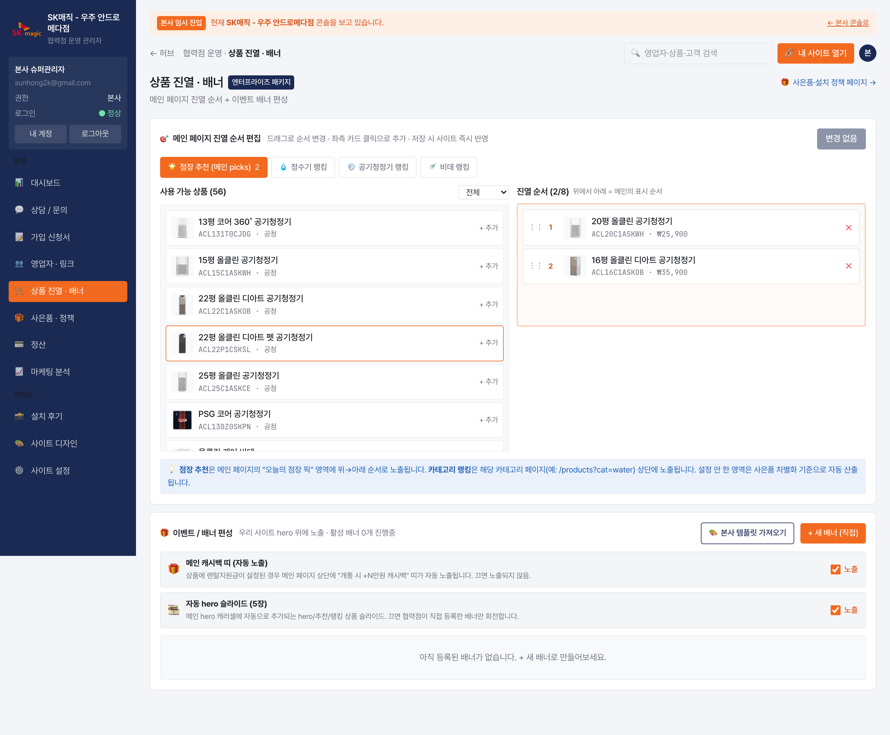
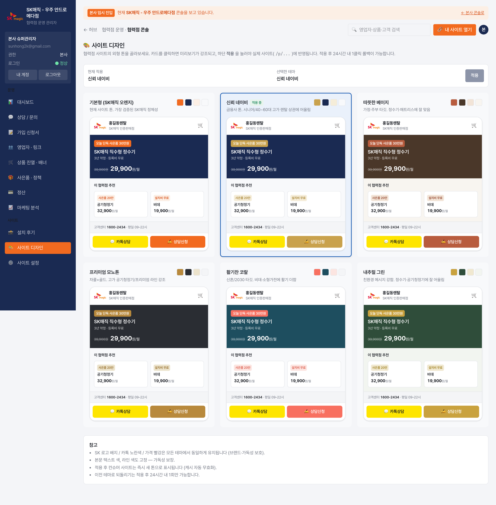
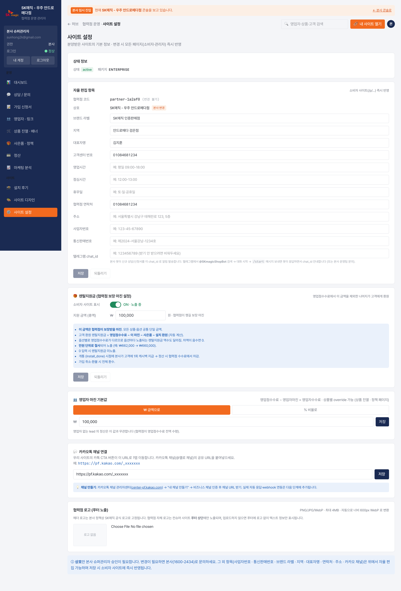
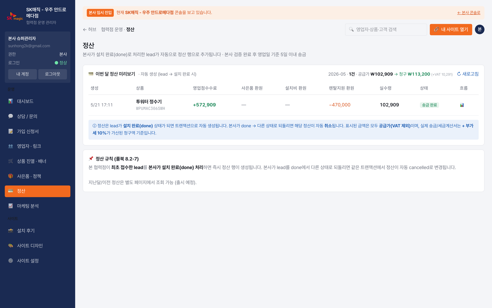
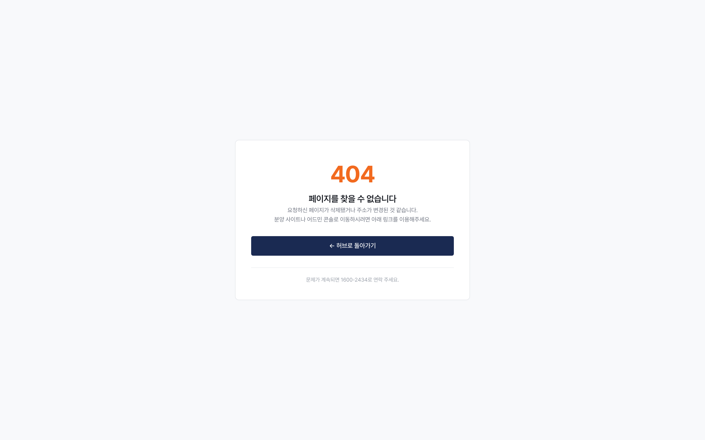
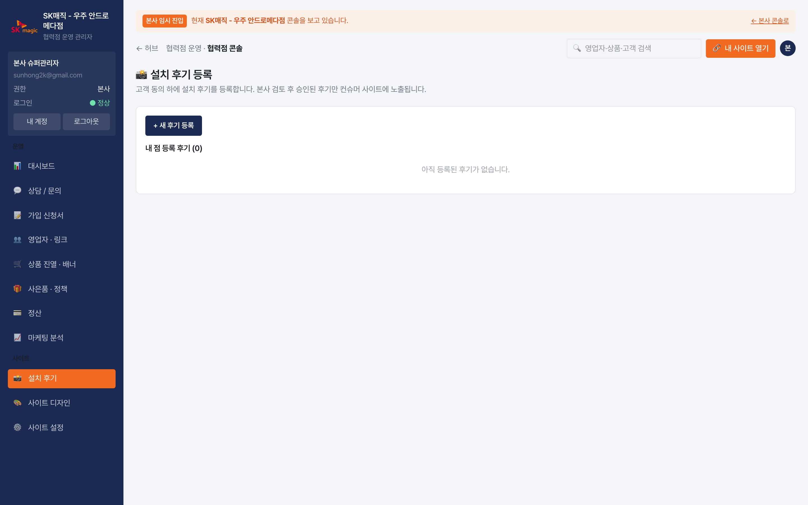

# 협력점 관리자 매뉴얼

SK매직 공식인증점 분양 플랫폼 · 2026-05

---

## 로그인

`https://skmagic-shop.com/login` → 본사로부터 받은 이메일·임시비번 입력 → 첫 로그인 시 본인 비밀번호 변경 강제

---

## 목차

| # | 메뉴 | 설명 |
|---|---|---|
| 01 | [운영 대시보드](#01-운영-대시보드) | KPI · 실시간 lead · 정산 미리보기 |
| 02 | [상담 / 문의](#02-상담--문의) | 신규 lead 응대·신청서 작성·본사 회신 |
| 03 | [가입 신청서](#03-가입-신청서) | 본인 점 EnrollmentForm 전체 목록 |
| 04 | [영업자 · 링크](#04-영업자--링크) | 영업자 등록·공유 링크·QR |
| 05 | [상품 진열 · 정책](#05-상품-진열--정책) | 메인 진열 + 사은품/설치비 환원 |
| 06 | [사이트 디자인](#06-사이트-디자인) | 메인 슬라이드 배너 + 본사 공통 배너 |
| 07 | [사이트 설정](#07-사이트-설정) | 회사 정보 · 카톡 채널 · CS 운영시간 · 로고 · 렌탈지원금 |
| 08 | [정산](#08-정산) | 이번 달 정산 미리보기 + 환원 흐름 |
| 09 | [마케팅 분석](#09-마케팅-분석) | 본인 점 유입 채널 분석 |
| 10 | [설치 후기](#10-설치-후기) | 후기 등록/관리 |

---

## 01. 운영 대시보드
**경로**: 로그인 → 사이드바 `📊 대시보드`

### 주요 영역
**상단 우측 📋 가입조건 버튼** — 본사가 등록한 SK매직 가입조건 (연령·신용등급·결제수단·헬프콜) 모달로 즉시 확인. 상담 중 자격 미달 사전 차단용.

**본사 공통 배너 슬라이드** — 본사가 푸시한 공통 공지/이벤트 배너. 본 점 사이트에서 숨기려면 디자인 메뉴에서 토글.

**KPI** — 이번 주 신규 lead · 상담 대기 · 회신 필요 · 이번 달 정산.

**실시간 신규 상담** — 최신 lead 카드 (자동 새로고침 5초). 클릭으로 상담/문의 페이지 진입.

**이번 달 정산 미리보기** — 정산된 건의 합계 + (공급가 / VAT / 청구액) 분리 표시.

**Quick Link** — 상담/문의 · 영업자/링크 · 상품 진열 · 정산.

---

## 02. 상담 / 문의
**경로**: 사이드바 `💬 상담 / 문의`

신규 lead 응대 + 가입 신청서 작성 + 본사 회신 처리.

### 단계별 액션
- `consult_wish` 신규 → 📞 상담 시작 → `consult_active`
- `consult_active` 상담 중 → 📝 신청서 작성 → 모달 진입 → 저장 시 `form_ready`
- `form_ready` 작성 완료 → 📤 본사 제출 → `apply_submitted` → 자동 chain `verify_pending`
- `verify_failed` / `verify_revise` 본사 회송 → 📝 수정 후 재제출 → 자동 chain `apply_submitted` → `verify_pending`
- 응대 종료 → ❌ 종료 → `consult_closed`

### 신청서 모달 prefill
타사보상 적용·선택 색상·결제수단 등 PriceConfigurator 에서 선택한 옵션이 자동 prefill 됨.

---

## 03. 가입 신청서
**경로**: 사이드바 `📋 가입 신청서`

본인 점 lead 의 EnrollmentForm 전체 목록. 검색 · 결제수단 필터 · 본사 회신 사유 확인.
- 카드 정보 (cardCompany · cardNumber · cardHolder · cardExpiry) 마스킹 노출
- 변경 이력 (EnrollmentFormHistory) 조회 가능

---

## 04. 영업자 · 링크
**경로**: 사이드바 `👥 영업자 / 링크`

### 영업자 등록
**단일 모드** (ID 직접 부여) — 이름 · 전화 · 로그인 ID(이메일) 직접 입력
- ID 비우면 자동 발급, 입력값이 이미 사용중이면 즉시 에러
- 등록 직후 토스트에 임시비번 노출 + 카톡 공유 문구 자동 클립보드 복사
- 이메일 ID 입력 시 **자동 메일 발송** — Resend 로 자격 안내 메일 자동 전송

**일괄 모드** (ID 자동) — textarea 한 줄에 한 명 ("이름 전화번호")

### 공유 링크
- 점 대표 링크 + 영업자별 단독 링크 (QR 자동 생성)
- 카톡 공유 문구 자동 생성 (점 대표 vs 영업자 단독)
- 영업자 정보 인라인 편집 (전화·로그인 이메일)

---

## 05. 상품 진열 · 정책
**경로**: 사이드바 `🛒 상품 진열 · 정책`

본 점 컨슈머 사이트의 메인 진열 + 상품별 정책.

### 진열
- Picks (메인 hero 아래 추천 카드)
- Ranking (카테고리별 랭킹 탭) — 정수기 · 공기청정기 · 비데 · 매트리스
- 드래그로 순서 변경, 자동 산출 fallback 옵션

### 정책 (PartnerPolicy)
- 사은품 (giftAmount + giftLabel)
- 설치비 환원 (installAmount)
- 영업자 마진 상품별 override (sellerMarginAmount/Percent)
- 본사 정책서 한도 검증

---

## 06. 사이트 디자인
**경로**: 사이드바 `🎨 사이트 디자인`

### 메인 슬라이드 배너 (Banner)
- 협력점 본인 배너 추가/편집 (scope=partner)
- 본사 공통 배너 (scope=global) read-only + 본인 사이트에서 숨김 토글
- 배너 효과 분석 (BannerEvent — impression/click)
- 5가지 레이아웃 (classic / image-bg / product-spotlight / promo-stamp / html)

### 본사 공통 배너 섹션
본사 공통 배너가 본인 사이트에 노출 중 → 카드별 🙈 숨김 / 👁 다시 노출 토글.

---

## 07. 사이트 설정
**경로**: 사이드바 `⚙️ 사이트 설정`

본인 협력점 회사 정보 + 영업자 마진 기본값 + 렌탈지원금.

### 자율 편집 항목
- 브랜드 라벨 (헤더 sub-text)
- 지역 · 주소 · 대표자명
- 고객센터 번호 · 협력점 연락처 · 사업자번호 · 통신판매번호
- 텔레그램 chat_id (협력점 알림용)
- **CS 운영시간** — 영업시간 / 점심시간 / 휴무일 (컨슈머 footer 노출)
- **카카오 채널 URL** — 컨슈머 카톡 상담 버튼

### 본사 승인 필요
- 상호 (partnerName) — 본사 콘솔에서만 변경

### 렌탈지원금
- 협력점이 챙길 보장 마진 (rentalSupportAmount) — 영업점수수료 − 보장 − 사은품 − 설치 = 렌탈지원금
- 노출 토글 (rentalSupportEnabled) — false 면 컨슈머 페이지에서 박스 자체 숨김

### 영업자 마진
- fixed (정액) / percent (비율) — 영업자 단독 링크로 들어온 lead 의 영업자 수수료 기본값
- PartnerPolicy.sellerMarginAmount/Percent 가 상품별 override

### 협력점 로고 (푸터)
- PNG/JPG/WebP · 4MB 이내 → 자동 600px WebP 변환
- 헤더 로고는 본사 정책상 SK매직 공식 로고 고정 — 협력점 로고는 푸터 전용
- 미설정 시 컨슈머 푸터에 로고 없이 텍스트만

---

## 08. 정산
**경로**: 사이드바 `💳 정산`

이번 달 정산 미리보기 (자동 새로고침 8초).

- 정산은 lead 가 본사 install_done 처리되면 자동 생성
- 본사가 done → 다른 상태로 되돌리면 자동 cancelled
- 컬럼: 영업점수수료 · 사은품 환원 · 설치비 환원 · 렌탈지원 환원 · 실수령
- 마진 흐름 모달 (📊) → 본사수수료 → 협력점 풀 → 영업자 분배 → 환원 흐름 시각화
- **공급가 / VAT / 청구액** 3단 표시 — 실제 송금/세금계산서는 청구액(공급가 + 10%) 기준

---

## 09. 마케팅 분석
**경로**: 사이드바 `📈 마케팅 분석`

본인 점 lead 의 채널·UTM·landing path·디바이스 분석.

---

## 10. 설치 후기
**경로**: 사이드바 `⭐ 설치 후기`

본인 점 설치 후기 등록 · 본사 승인 워크플로우.
- pending → approved (본사 승인 후 컨슈머 노출)
- 사진·평점·지역 첨부
- 가입한 옵션 (mode · contractPeriod) 자동 기록
