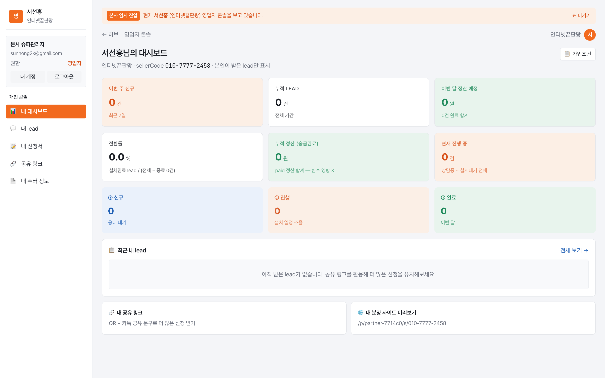
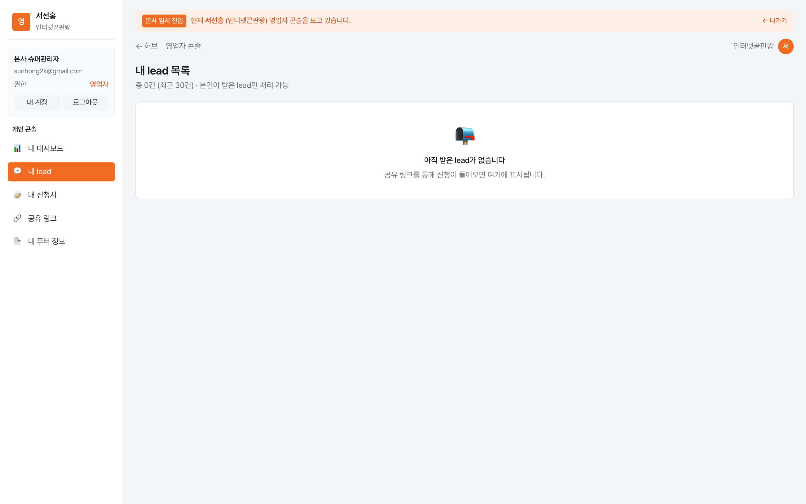
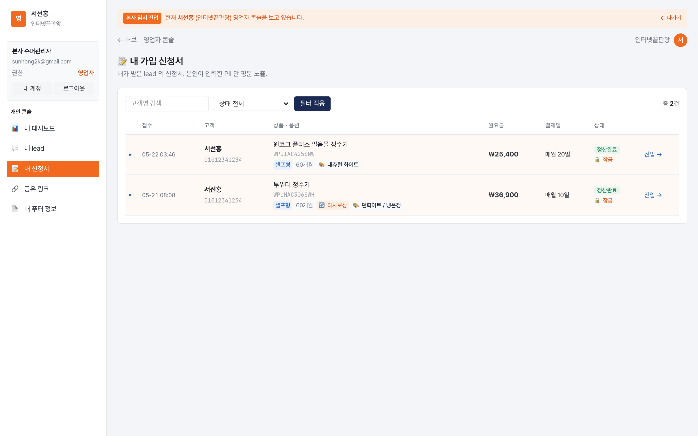
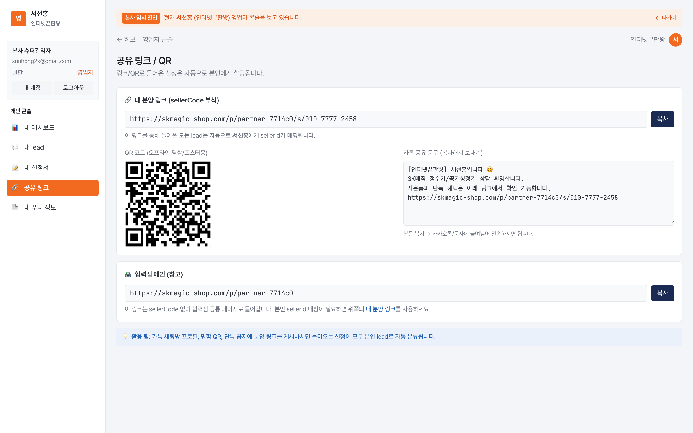
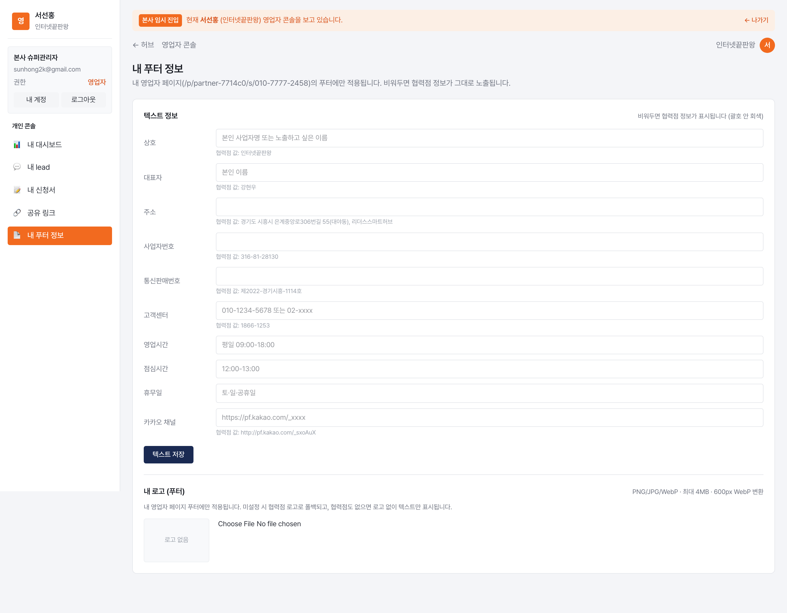

# 영업자 매뉴얼

SK매직 공식인증점 분양 플랫폼 · 2026-05

---

## 로그인

`https://skmagic-shop.com/login` → 협력점으로부터 카톡/이메일로 받은 자격으로 로그인 → 첫 로그인 시 본인 비밀번호 변경 강제 (`/admin/profile?force=1`)

---

## 목차

| # | 메뉴 | 설명 |
|---|---|---|
| 01 | [내 대시보드](#01-내-대시보드) | KPI · 최근 내 lead · 가입조건 |
| 02 | [내 lead](#02-내-lead) | 본인이 받은 lead 처리 |
| 03 | [내 신청서](#03-내-신청서) | 본인이 받은 lead 의 신청서 |
| 04 | [공유 링크](#04-공유-링크) | 본인 단독 영업 링크 + QR + 카톡 문구 |
| 05 | [내 푸터 정보](#05-내-푸터-정보) | 본인 페이지 푸터 override |

---

## 01. 내 대시보드
**경로**: 영업자 로그인 → 사이드바 `📊 내 대시보드`

### KPI
**상단 우측 📋 가입조건 버튼** — 본사가 등록한 SK매직 가입조건 즉시 확인 (상담 중 자격 미달 확인용).

**1번째 행 (3 카드)**
- 이번 주 신규 (최근 7일)
- 누적 lead (전체 기간)
- 이번 달 정산 예정 — 정산 완료 N건 + 진행 중 lead 예상 합계 부기

**2번째 행 (3 카드)**
- **전환률** — 설치완료 lead / (전체 − 종료) × 100, 소수점 1자리
- **누적 정산** — paid 정산만, 환수 영향 X
- **현재 진행 중** — consult_active ~ install_pending 전 단계

**3번째 행 (3 타일)** — 신규 / 진행 / 완료 한눈에

### 최근 내 lead
최근 5건 카드. 환수 진행 여부 + 정산된 sellerPayout 또는 **예상 sellerPayout** 표시.
- 예상치는 협력점이 책정한 sellerMargin 기준으로 미리 계산

### Quick Link
- 🔗 내 공유 링크 (QR + 카톡 공유 문구)
- 🌐 내 분양 사이트 미리보기 (영업자 단독 페이지)

---

## 02. 내 lead
**경로**: 사이드바 `💬 내 lead`

본인이 받은 lead 최대 30건 테이블.

### 컬럼
- 접수 (날짜·경과시간)
- 고객 (이름·마스킹 휴대폰)
- 상품 / 옵션 (선택 모드·약정·타사보상)
- 월 렌탈가
- **내 수수료** — 정산된 액수 (Settlement 완료) 또는 예상 (협력점이 책정한 sellerMargin 기준)
- 단계 (lead status)
- 다음 할 일 (액션 버튼)

### 액션 (단계별)
협력점 콘솔의 상담/문의 페이지와 동일한 흐름 — 본인이 받은 lead만 처리 가능.

---

## 03. 내 신청서
**경로**: 사이드바 `📝 내 신청서`

본인이 받은 lead 의 EnrollmentForm 만 조회. 권한별 마스킹 적용 (영업자 = 협력점과 동일 수준).

---

## 04. 공유 링크
**경로**: 사이드바 `🔗 공유 링크`

본인 단독 영업 링크.
- URL: `https://skmagic-shop.com/p/<partnerCode>/s/<sellerCode>` 또는 협력점 커스텀 도메인 사용 시 그쪽
- QR 자동 생성 (200x200 + 600x600 다운로드)
- 카톡 공유 문구 자동 생성 — 본인 이름·점 이름·상담 링크·전화 포함

---

## 05. 내 푸터 정보
**경로**: 사이드바 `📄 내 푸터 정보`

본인 영업자 페이지(`/p/<partnerCode>/s/<sellerCode>`)의 푸터를 자기 정보로 override.

### 텍스트 정보 (11개 필드)
- 상호 · 대표자 · 주소
- 사업자번호 · 통신판매번호 · 고객센터
- 영업시간 · 점심시간 · 휴무일
- 카카오 채널 URL

각 필드 **비워두면 협력점 정보로 자동 폴백** (괄호 안 회색으로 폴백 값 미리보기).

### 내 로고 (푸터)
- PNG/JPG/WebP · 4MB 이내 · 자동 600px WebP 변환
- 비워두면 협력점 로고로 폴백 (협력점 로고도 없으면 텍스트만)
- 헤더 로고는 본사 정책상 SK매직 공식 로고 고정

### 적용 범위
**내 영업자 페이지에만** 적용. 협력점 메인 페이지나 다른 영업자 페이지에는 영향 X.

---

## 부록 — 본인 계정 / 비밀번호

`/admin/profile` — 본인 계정 정보 + 비밀번호 변경.

### 영업자가 직접 수정 가능
- 이름 · 로그인 이메일
- 전화 (Seller.phone)
- **텔레그램 chat_id** — 본인 lead 인입 시 본인 텔레그램에 즉시 알림 (5-16자리 숫자)
  - `@userinfobot` 에게 `/start` 보내면 본인 chat_id 확인 가능
- 비밀번호 변경 (현재 비번 + 새 비번)

비밀번호 분실 시 본사 슈퍼관리자에 문의 → 임시 비번 발급 후 자격 안내 메일 자동 발송.
