# 본사 슈퍼관리자 매뉴얼

㈜우성종합통신 · SK매직 공식인증점 분양 플랫폼 · 2026-05

---

## 목차

| # | 메뉴 | 설명 |
|---|---|---|
| 01 | [전체 대시보드](#01-전체-대시보드) | KPI · 협력점 순위 · 빠른 진입 |
| 02 | [전체 신청서](#02-전체-신청서) | 모든 협력점의 가입 신청서 조회·검색 |
| 03 | [인증 처리](#03-인증-처리) | 신청서 본사 인증 큐 (verify_pending → verify_failed/revise) |
| 04 | [설치 완료 처리](#04-설치-완료-처리) | install_pending → install_done 전이 |
| 05 | [협력점 관리](#05-협력점-관리) | Partner 생성/수정/퇴점, lead 인계 |
| 06 | [사용자 관리](#06-사용자-관리) | hq / partner_admin / seller User 발급·비번 재설정 |
| 07 | [감사 로그](#07-감사-로그) | 정책/사용자/lead 변경 이력 |
| 08 | [승인 대기열](#08-승인-대기열) | 분양 신청·수수료 인상·정산 이의 등 결재 큐 |
| 09 | [중복 DB 판정](#09-중복-db-판정) | 중복 의심 lead 본사 확정/무시 |
| 10 | [후기 승인](#10-후기-승인) | 협력점·영업자가 등록한 설치 후기 승인 |
| 11 | [운영 이상감지](#11-운영-이상감지) | 비정상 패턴(중복·과다·예외) 알림 |
| 12 | [마케팅 분석](#12-마케팅-분석) | 유입 채널·UTM·전환률 |
| 13 | [분양신청 링크 공유](#13-분양신청-링크-공유) | 분양 페이지 QR/링크 |
| 14 | [상품 마스터](#14-상품-마스터) | SK매직 상품 카탈로그 |
| 15 | [기준 정책](#15-기준-정책) | HqPolicy 옵션별 baseCommission·hqMargin |
| 16 | [배너 템플릿](#16-배너-템플릿) | 본사가 만든 협력점 공통 배너 템플릿 |
| 17 | [본사 공통 배너](#17-본사-공통-배너) | 전 협력점 컨슈머 사이트 공통 노출 배너 |
| 18 | [본사 공지](#18-본사-공지) | 협력점 콘솔 상단 broadcast |
| 19 | [상품 크롤링](#19-상품-크롤링) | SK매직 매직몰 크롤 실행/이력 |
| 20 | [크롤 검토 큐](#20-크롤-검토-큐) | 신규/변경 상품 본사 승인 큐 |
| 21 | [외부 API 채널](#21-외부-api-채널) | 쿠팡·11번가 등 외부 채널 lead 수신 |
| 22 | [가입조건 fact sheet](#22-가입조건-fact-sheet) | 영업자/협력점 노출용 SK매직 가입조건 |
| 23 | [본사 표준 메인페이지](#23-본사-표준-메인페이지) | 신규 협력점 생성 시 복제될 기준 |
| 24 | [정산 / 수수료](#24-정산--수수료) | 월별 정산 큐 + 협력점별 정산서 |
| 25 | [환수 관리](#25-환수-관리) | 정산 송금 후 환수 시작/진행/완료 |

---

## 01. 전체 대시보드
**경로**: 본사 슈퍼관리자 로그인 → 사이드바 `📊 전체 대시보드`

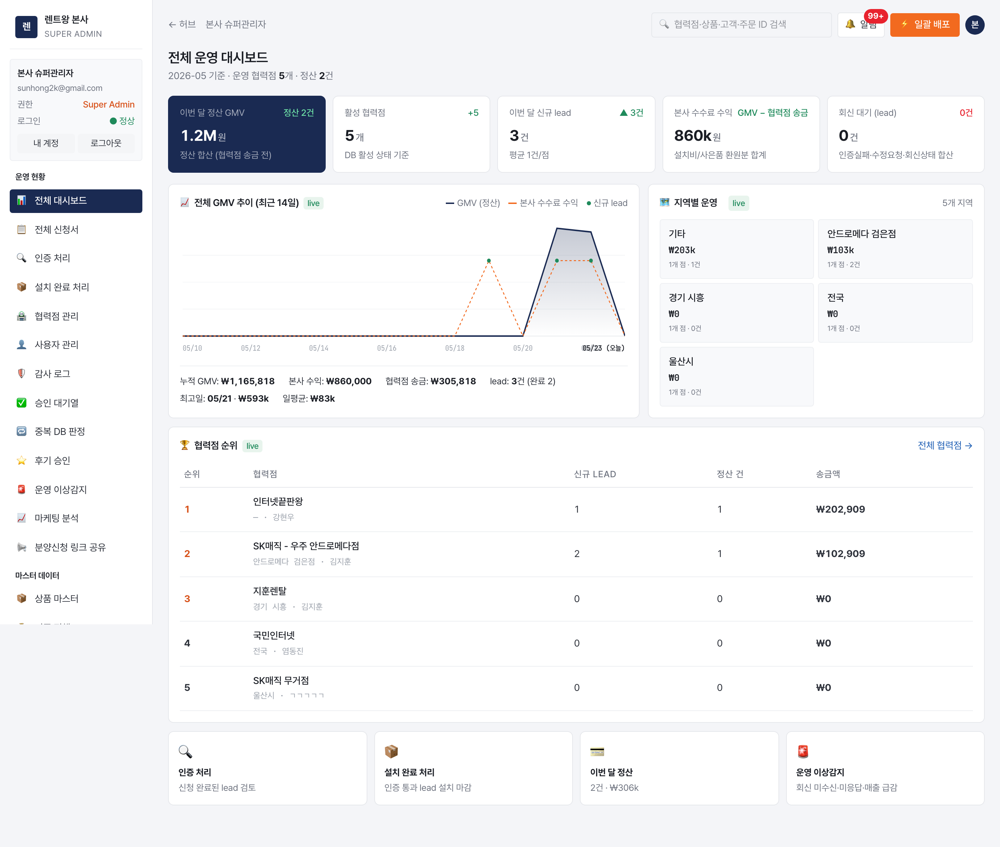

### 주요 영역
**① 상단 KPI 4종**
- 이번 달 정산 GMV (정산 N건, 협력점 송금 합계)
- 활성 협력점 수 (DB 활성 상태 기준)
- 이번 달 신규 lead (평균 일평균)
- 본사 수수료 = GMV − 협력점 송금 (설치비사은품 환원금 합산)
- 회신 대기 (lead) — 인증실패·수정요청·미응답 합계

**② 전체 GMV 추이 (최근 14일)** — GMV(정산) · 본사 수수료 수익 · 신규 lead 세 라인 차트

**③ 지역별 운영** — 활성 지역별 협력점 수·당월 매출

**④ 협력점 순위** — 신규 lead·정산 건수·송금액 기준 정렬

**⑤ 빠른 진입** — 인증 처리 / 설치 완료 처리 / 이번 달 정산 / 운영 이상감지

---

## 02. 전체 신청서
**경로**: 사이드바 `📋 전체 신청서`

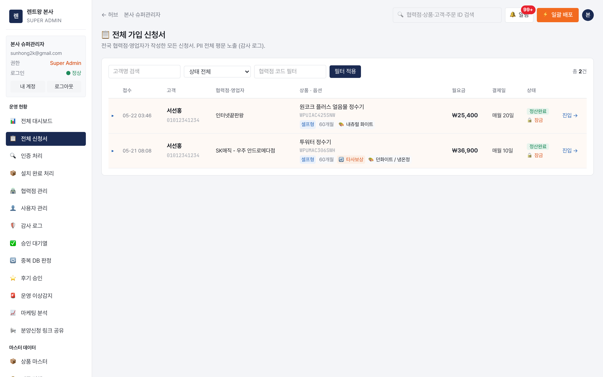

모든 협력점의 EnrollmentForm 조회. 검색·필터·상세 진입.

- 검색: 고객명·휴대폰·협력점·상품
- 필터: lead 상태 · 결제수단 · 카드/자동이체
- 행 클릭 → 신청서 상세 (역할별 마스킹 적용된 PII 노출)

---

## 03. 인증 처리
**경로**: 사이드바 `🔍 인증 처리`

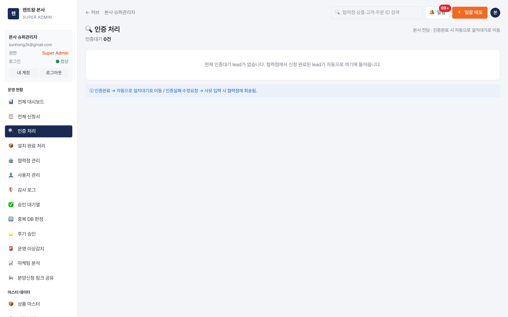

협력점이 `apply_submitted` 한 신청서를 본사가 검증 → `verify_pending` 큐에서 처리.

**액션**:
- ✅ **인증 완료** → `install_pending` 으로 전이
- ❌ **인증 실패** → `verify_failed` 회송 (사유 메모 필수, 텔레그램 알림 자동)
- ✏ **수정 요청** → `verify_revise` 회송 (협력점이 신청서 수정 후 재제출)

---

## 04. 설치 완료 처리
**경로**: 사이드바 `📦 설치 완료 처리`

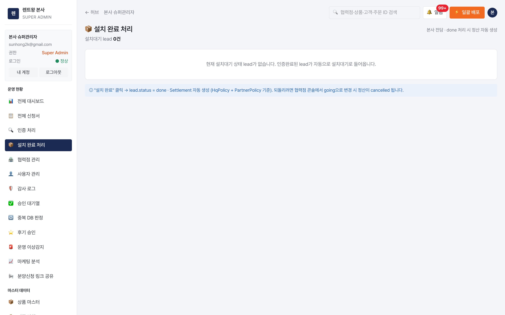

`install_pending` lead 를 본사 SK매직과 일정 조율 → 설치 확인 후 `install_done` 처리.

- ✅ **설치 완료** → `install_done` → 자동 chain `settle_pending` (정산 큐 진입)
- ❌ **설치 취소** → `install_cancel` (사유 필수, Settlement 자동 cancelled)

---

## 05. 협력점 관리
**경로**: 사이드바 `🏪 협력점 관리`

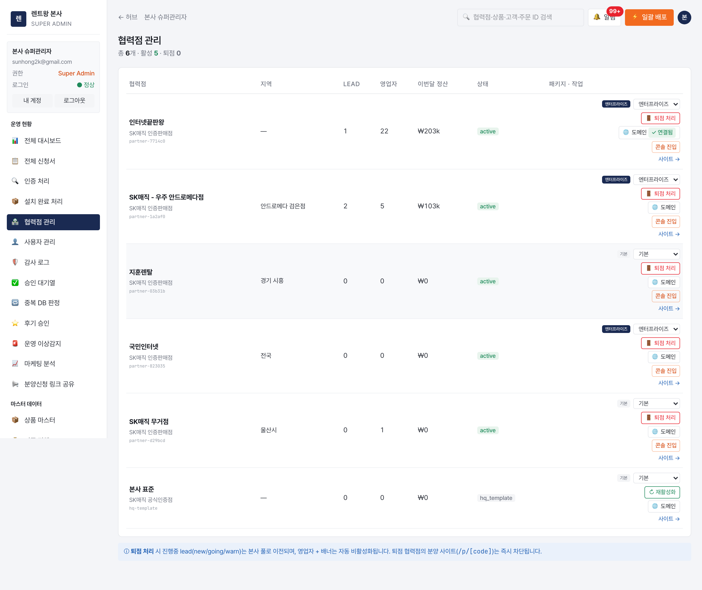

- 협력점 목록 + 상태(active/suspended/closed)
- 행 진입 → 협력점 상세 (정보 수정·tier 변경·퇴점 처리·lead 강제 인계)
- **콘솔 진입** 버튼 → `hq_view_partner` 쿠키 세팅 → `/admin/franchise` 협력점 콘솔로 임시 진입

---

## 06. 사용자 관리
**경로**: 사이드바 `👤 사용자 관리`

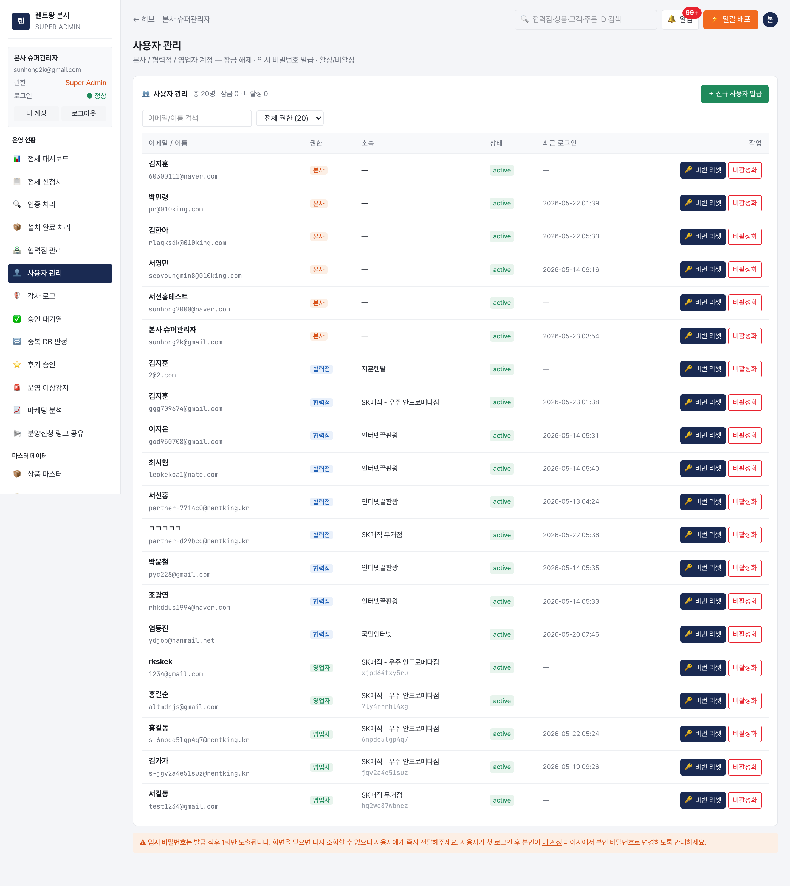

전 사용자 (hq · partner_admin · seller) User row 관리.

- 본사 슈퍼관리자만 다른 사용자의 비번 재설정 가능
- 재설정 시 임시비번 자동 생성 → 이메일 자동 발송 (Resend)
- 영업자/협력점 비활성화 (lead 신규 인입 차단)

---

## 07. 감사 로그
**경로**: 사이드바 `🛡 감사 로그`

정책/사용자/lead/신청서 변경 이력 — 누가 언제 무엇을 바꿨는지.
- 액터(role + email) · 액션 · 대상 · 변경 전후값 (Json diff)
- 분쟁/감사 대응용 영구 보존

---

## 08. 승인 대기열
**경로**: 사이드바 `✅ 승인 대기열`

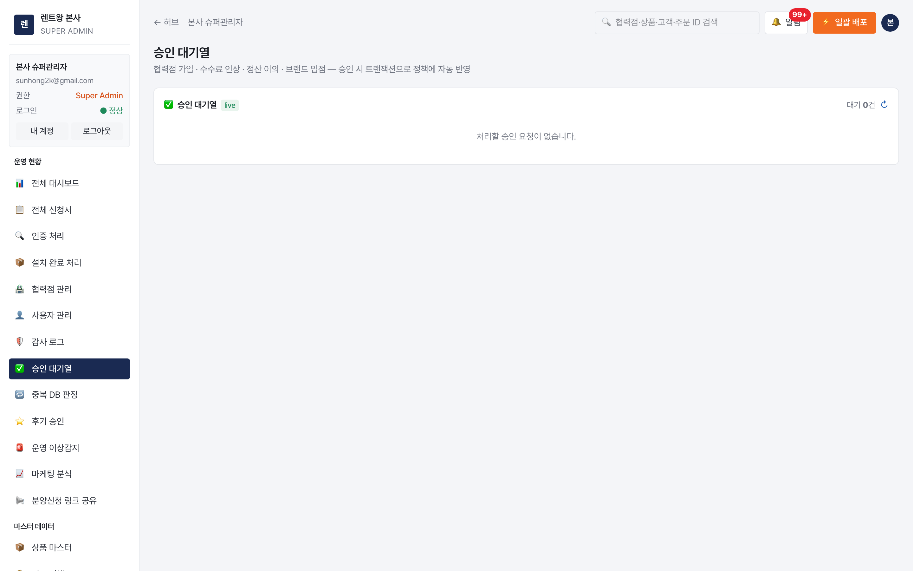

본사 결재가 필요한 ApprovalRequest 큐. 종류:
- `partner_signup` — 신규 분양 신청 → 승인 시 Partner 생성 + 본사 표준 페이지 자동 복제 + 임시비번 발급 메일
- `commission_increase` — 협력점이 본사 수수료 인상 요청
- `settlement_dispute` — 정산 이의

---

## 09. 중복 DB 판정
**경로**: 사이드바 `🔁 중복 DB 판정`

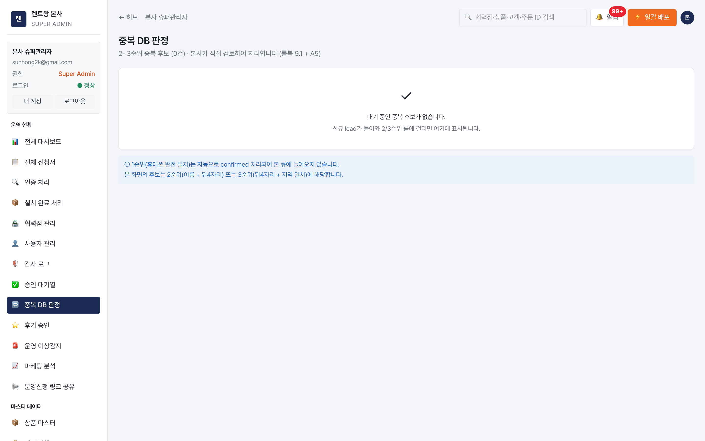

같은 phoneRaw로 들어온 lead 들 중 `duplicateStatus=possible` 표시된 건을 본사가 confirmed/bad_db 로 판정.
- confirmed → 1순위 협력점 보존 + 후순위 종료
- bad_db → 의도적 도배 → 가짜 lead 처리

---

## 10. 후기 승인
**경로**: 사이드바 `⭐ 후기 승인`

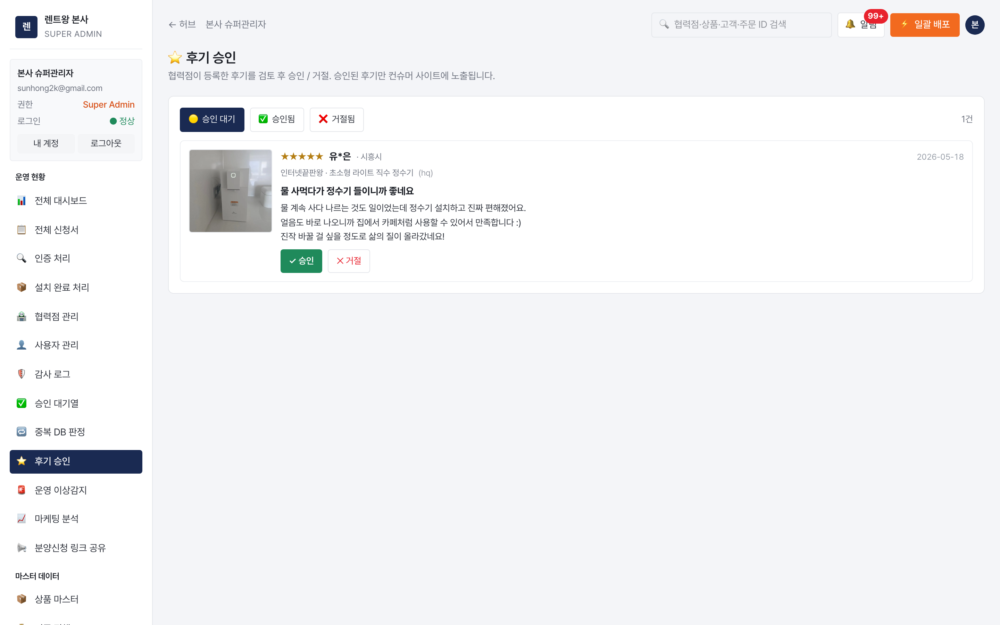

협력점·영업자가 등록한 설치 후기 `approvalStatus=pending` 큐.
- ✅ 승인 → 컨슈머 사이트에 published
- ❌ 반려 → 사유 입력 (협력점에 전달)
- 부적절 후기 강제 hidden 처리

---

## 11. 운영 이상감지
**경로**: 사이드바 `🚨 운영 이상감지`

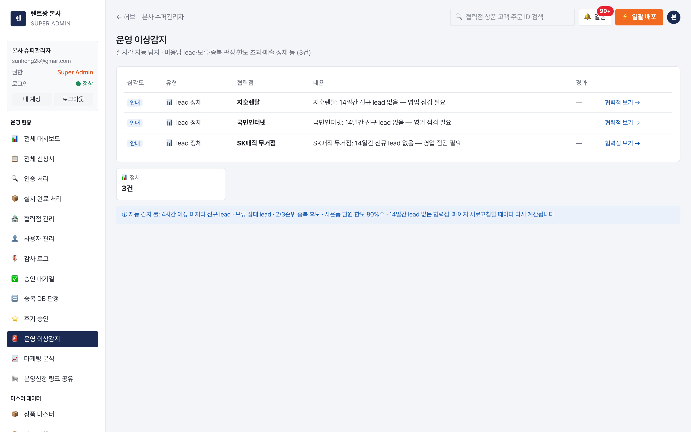

비정상 운영 패턴 자동 감지:
- 정책 수수료 환산 한도 초과
- 한 협력점에서 동시간대 lead 다발
- 같은 영업자가 같은 phoneRaw 반복

---

## 12. 마케팅 분석
**경로**: 사이드바 `📈 마케팅 분석`

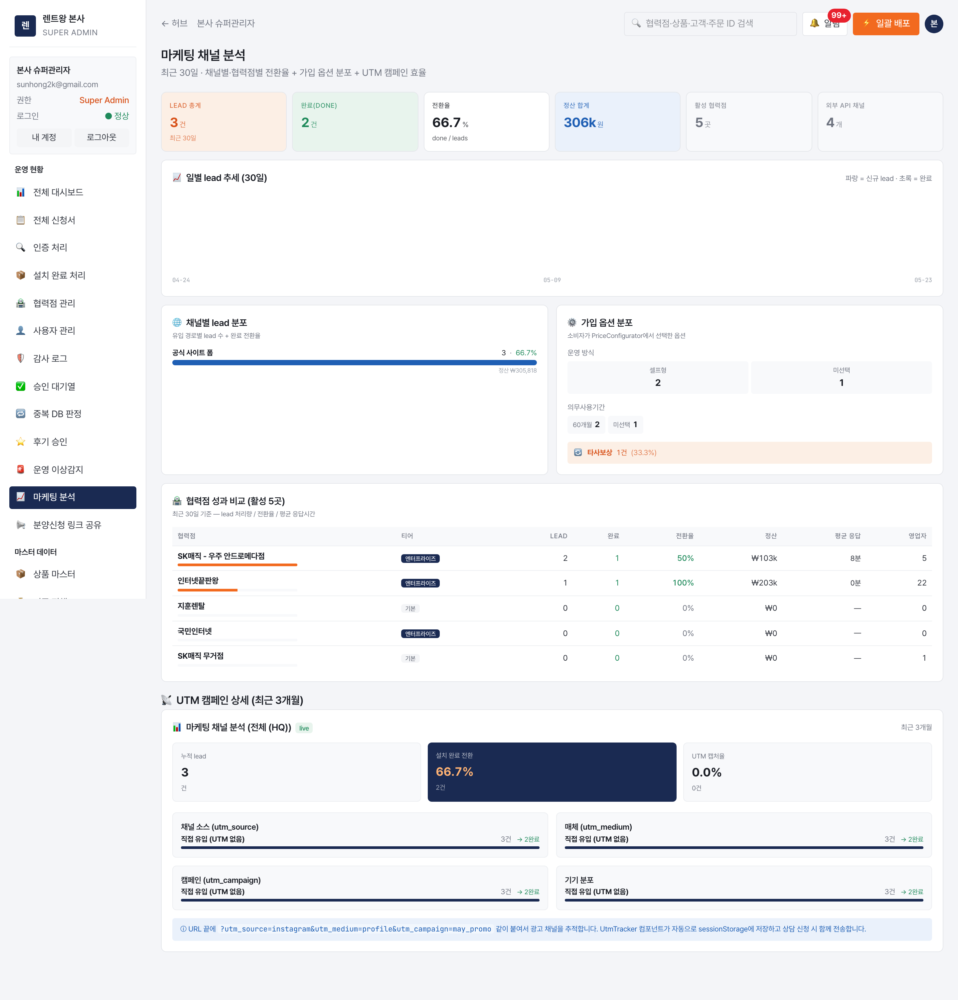

UTM·landing·디바이스·시간대별 lead 분석.
- 채널별 전환률 (consult → install_done)
- 주말/평일 / 시간대 추이

---

## 13. 분양신청 링크 공유
**경로**: 사이드바 `📢 분양신청 링크 공유`

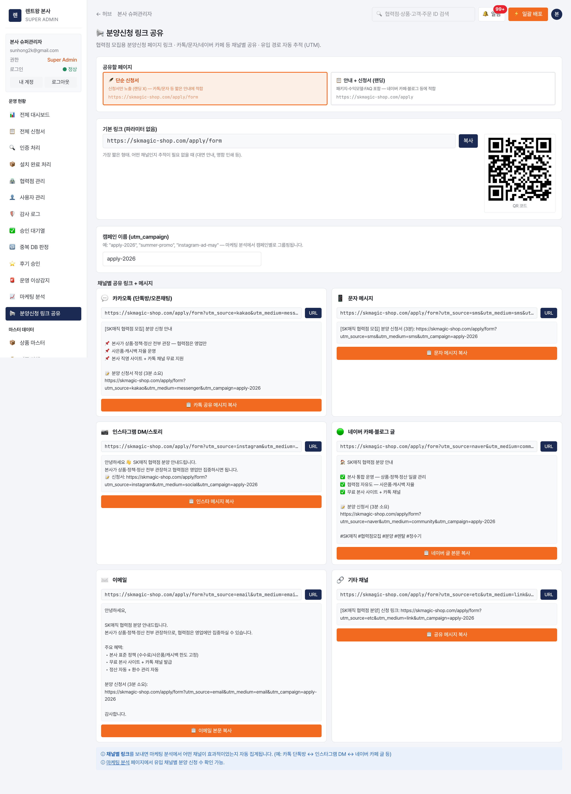

`/apply` 분양 신청 페이지를 카톡·SNS로 공유할 QR + URL + 카톡 문구.
- 공유 토글 ON 시 일반인이 신청 가능, OFF 시 차단

---

## 14. 상품 마스터
**경로**: 사이드바 `📦 상품 마스터`

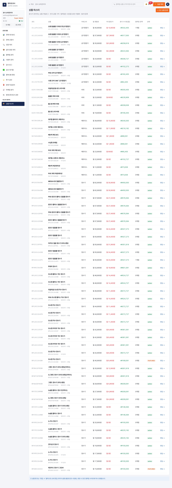

SK매직 상품 카탈로그 (Product). 상품별 가격·priceMatrix·specs·콘텐츠 이미지.
- 신규 상품: 크롤 큐에서 본사 승인 시 자동 추가
- 기존 상품: 직접 편집 (status active/discontinued)

---

## 15. 기준 정책
**경로**: 사이드바 `💰 기준 정책`

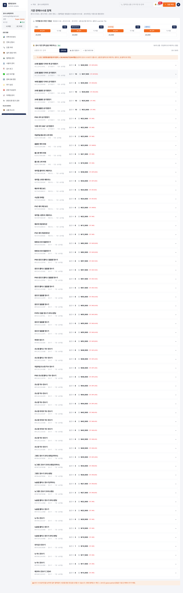

HqPolicy 옵션별 (mode × contractPeriod) baseCommission · monthIncentive · hqMargin · installSubsidy · refundLimitRatio.
- VAT 제외(공급가) 기준
- 협력점 협력점수수료 = baseCommission − hqMargin (티어 기본값 또는 옵션 override)

---

## 16. 배너 템플릿
**경로**: 사이드바 `🎨 배너 템플릿`

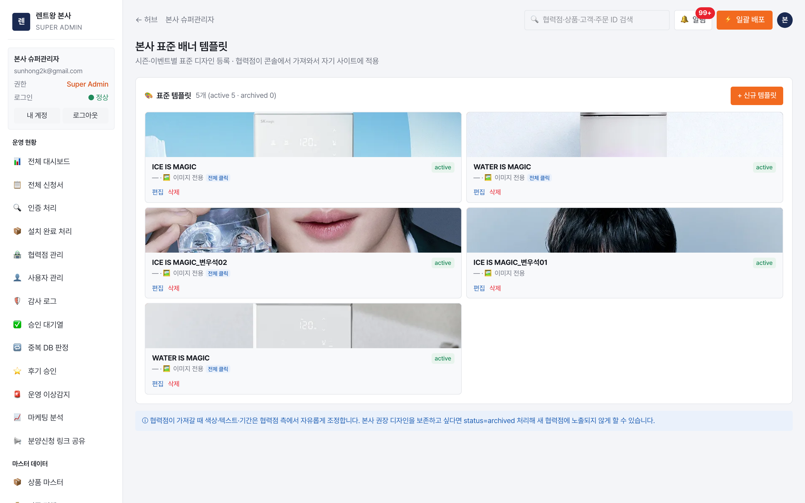

본사가 만든 협력점 공통 배너 템플릿. 협력점이 콘솔에서 자기 사이트에 적용 가능.

---

## 17. 본사 공통 배너
**경로**: 사이드바 `📢 본사 공통 배너`

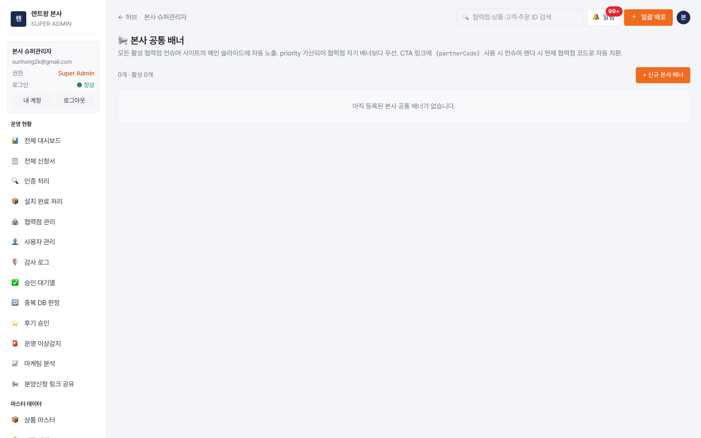

전 활성 협력점 컨슈머 사이트에 동시 노출되는 글로벌 배너 (scope=global).
- 🚀 푸시 버튼으로 draft → active 전이 시 협력점 콘솔에 broadcast + 텔레그램 알림
- 협력점이 본인 사이트에서 개별 숨김 가능 (`displayConfig.hiddenGlobalBannerIds`)

---

## 18. 본사 공지
**경로**: 사이드바 `📢 본사 공지`

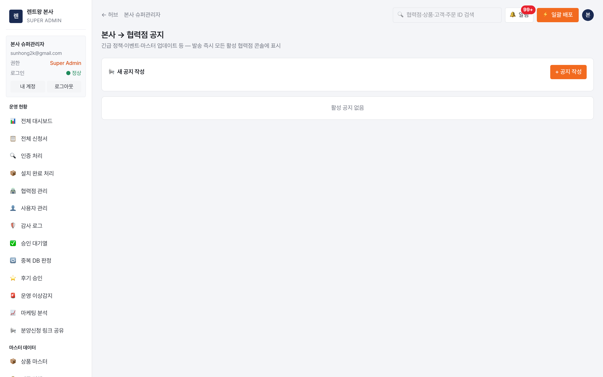

협력점 콘솔 상단에 띠 형태로 노출되는 broadcast 메시지.

---

## 19. 상품 크롤링
**경로**: 사이드바 `🔄 상품 크롤링`

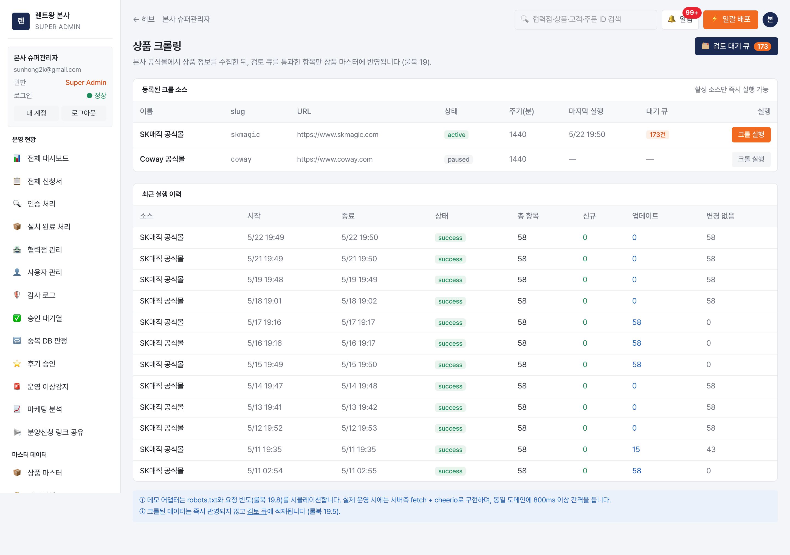

CrawlSource 관리 + 수동/cron 크롤 실행 + 실행 이력.
- skmagic 어댑터 자동 등록
- 크롤 결과 변경 있을 시 본사 텔레그램 알림

---

## 20. 크롤 검토 큐
**경로**: 사이드바 (`🔄 상품 크롤링` 하위)

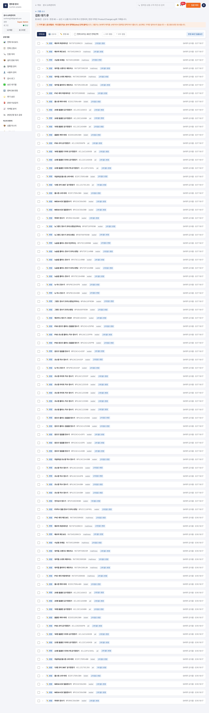

크롤된 신규/변경 상품을 본사가 승인/반려 → Product 마스터 반영.
- 필터: 전체 / 🆕 신규 / ✏ 변경
- 일괄 승인 / 일괄 반려 (단일/bulk 모드)
- 카드 접힘/펼침 토글 — 의심스러운 것만 펼침
- 숫자 필드 Δ 표시 (가격 +3000 / 약정 −12 등)
- 반려 사유 모달 (multiline)

---

## 21. 외부 API 채널
**경로**: 사이드바 `🔌 외부 API 채널`

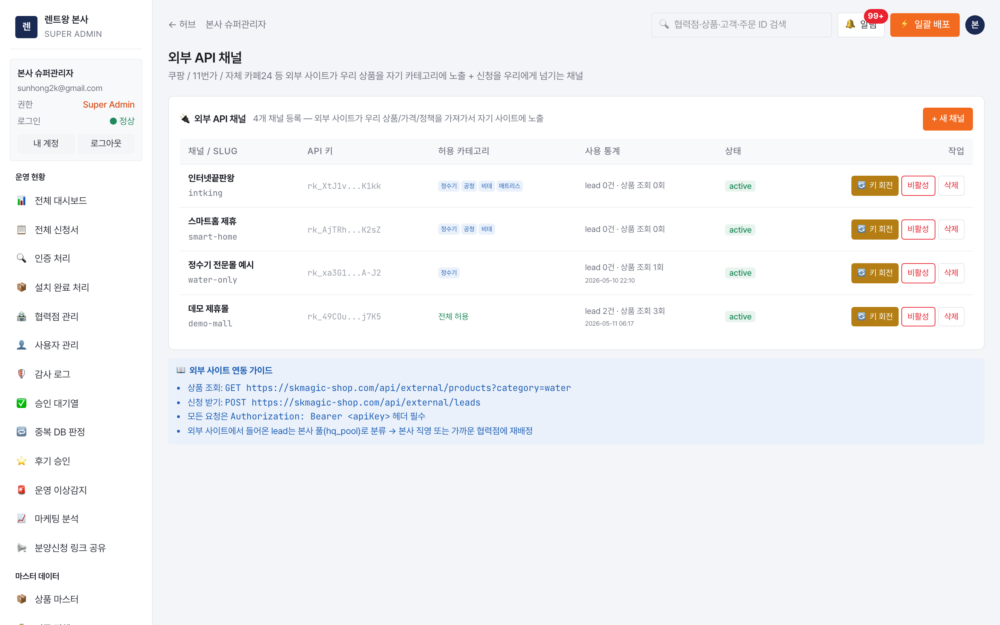

쿠팡·11번가·카페24 등 외부 채널이 우리 상품을 자기 사이트에 노출하고 신청을 우리에게 넘기는 채널 관리.

---

## 22. 가입조건 fact sheet
**경로**: 사이드바 `📋 가입조건 fact sheet`

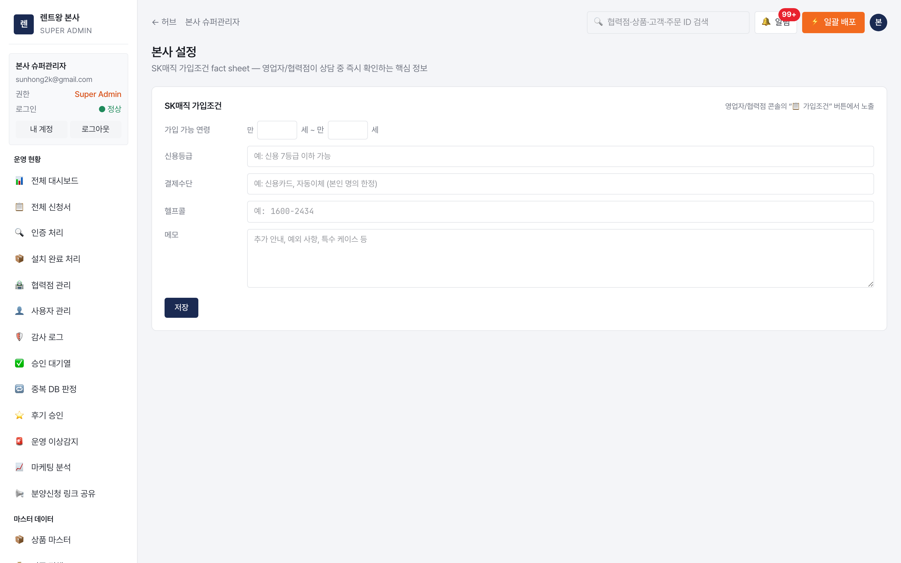

SK매직 가입조건 (연령 · 신용등급 · 결제수단 · 헬프콜) 본사 편집 페이지.
- 영업자/협력점 콘솔 상단의 `📋 가입조건` 버튼 → 모달로 read-only 조회
- 상담 중 즉시 확인 → 자격미달 사전 차단

---

## 23. 본사 표준 메인페이지
**경로**: 사이드바 `📐 본사 표준 메인페이지`

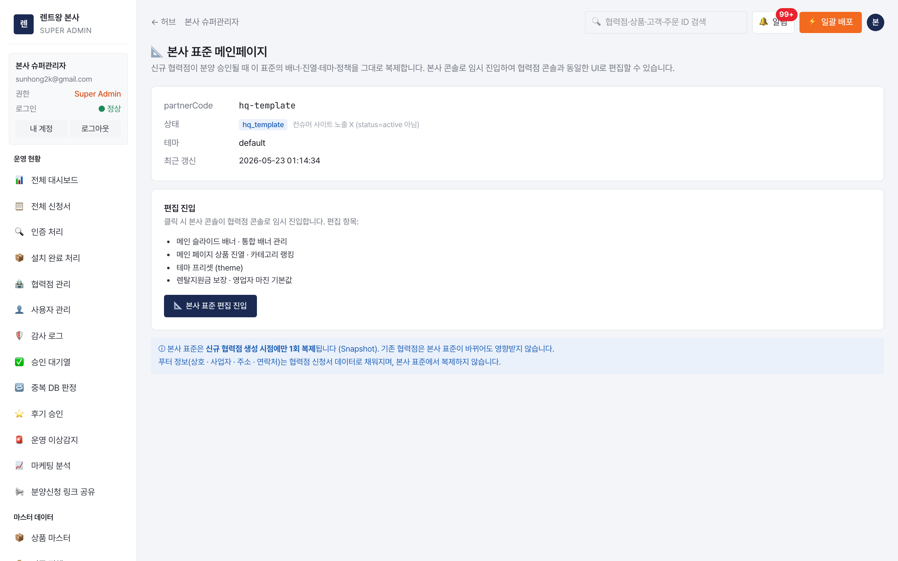

신규 협력점이 분양 승인될 때 자동으로 복제되는 본사 표준.
- 복제 항목: 배너 · 진열 · 테마 · 정책 · 렌탈지원금 보장값 · 영업자 마진 기본값
- 푸터 정보(상호·사업자·주소 등)는 복제 X — 신청서 데이터로 채움
- "📐 본사 표준 편집 진입" 버튼 → 협력점 콘솔로 임시 진입해 편집

---

## 24. 정산 / 수수료
**경로**: 사이드바 `💳 정산 / 수수료`

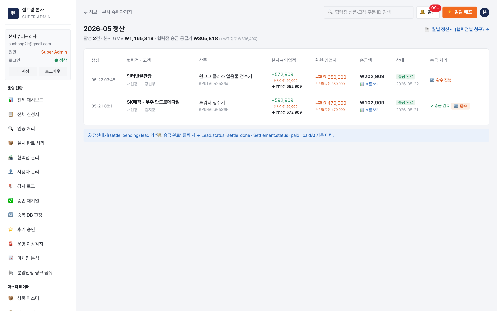

월별 Settlement 큐 + 협력점별 정산서 (인쇄 가능).

- 상단 요약: 활성 N건 · GMV · 협력점 송금 공급가 (+VAT 청구액 부기)
- `📄 월별 정산서` → 협력점별 청구액(공급가 + VAT 10%) 정산서
- 행 액션: 💸 송금 완료 → `settle_done` 전이
- ⚠ HQ pool 정산 누락 — 본사 풀(partnerId=null) lead 가 install_done 도달했으나 Settlement 미생성된 건 알림

---

## 25. 환수 관리
**경로**: 사이드바 `🔄 환수 관리`

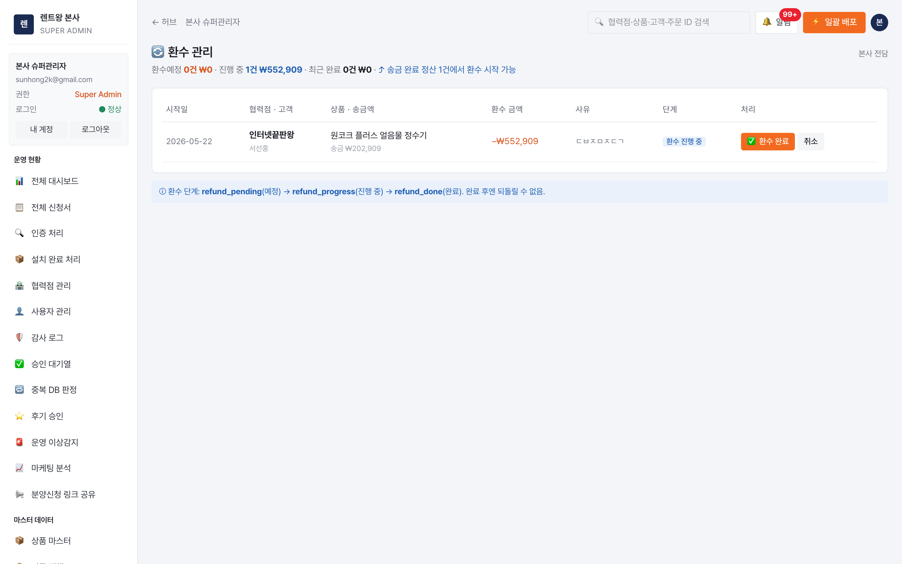

정산 송금 후 환수 (refund) 진행:
- `refund_pending` → `refund_progress` → `refund_done`
- 한도: partnerCommission (영업점수수료 전액)
- 환수 사유 + 금액 입력 → 시작
- refund_done 은 되돌릴 수 없음 (감사 보존)
